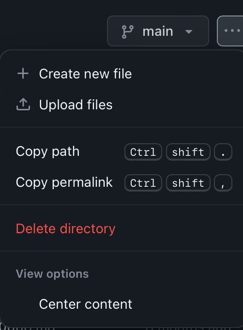
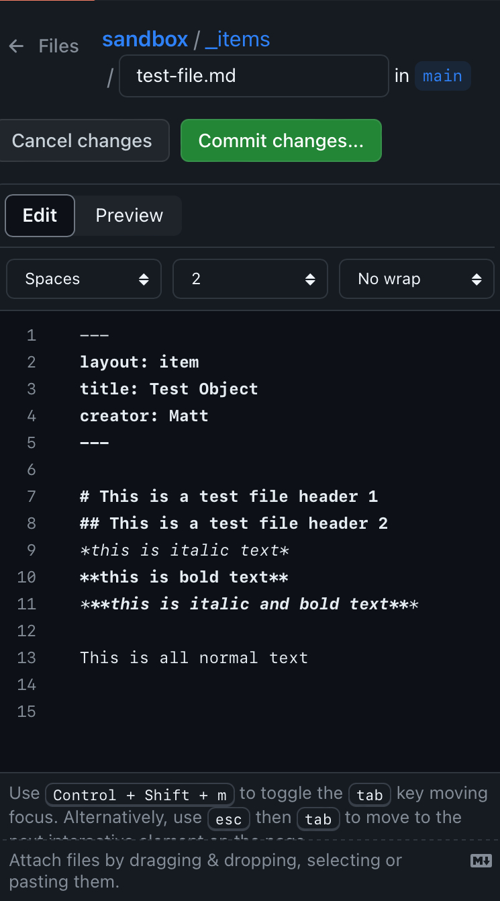
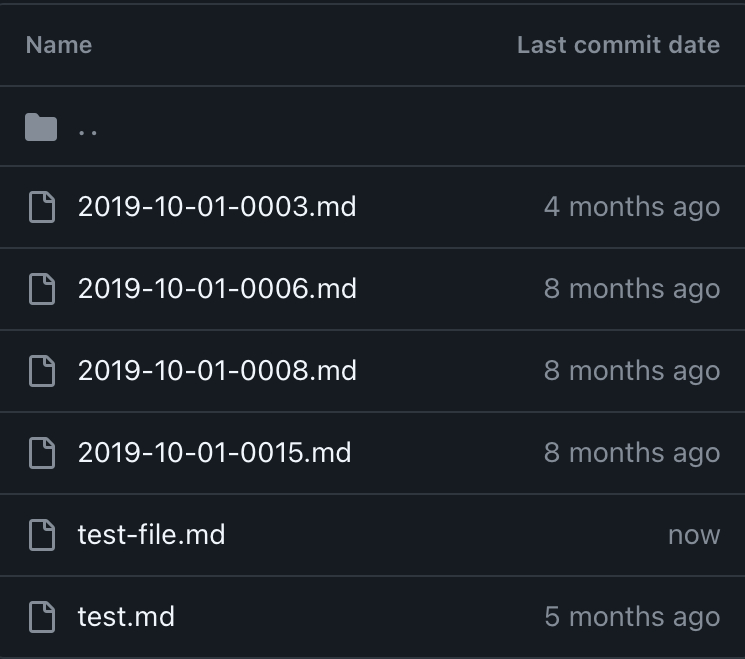

# Creating Markdown Files
This section will cover how to create markkdown files in a few different ways. 

> Note: The naming conventions mentioned and the metadata structure for each method will be the same throughout.

### Quick Notes About This Section
- The metadata shown in some examples will not be the metadata that we have in the Commmunity Archive Repo.
- All files that are created or uploaded **must** have a '.md' file extention. This is the Markdown file extension.
- All metadata **must** start with three dashes (---) in line 1 and three dashes under the last line of metadata.

## Creating Markdown Files on iPhone
This section covers how to create a markdown file on an iPhone, using a web brower.

- Navigate to the folder where you want to file to live. In this example, we are creating a new item in a repository called *Sandbox*.

- In the top right corner, select the three dots. This gives you the option to create a new file (what we are using in this example) or to upload files from your iPhone.

- When selecting *Create new file*, you will need to name the file. Make sure that there are no spaces or special characters in the file name. Once you have all your metadata entered, push the green *Commit changes...* button.

- This screen lets your type in a more detailed coomment for the file you are creating (it is the same screen for any changes that are made). This is an optional step to provide more detail.
   
   You will also see two options to either commit to the main branch or create a new branch. **By default, you will want to create to the main branch.** Creating a new branch is outside the scope of this toolkit.

   If you are ready to create the file, push *Commit changes* again.

- You will be brought back to screen that shows all the files in the folder you were working in with your new file there.

