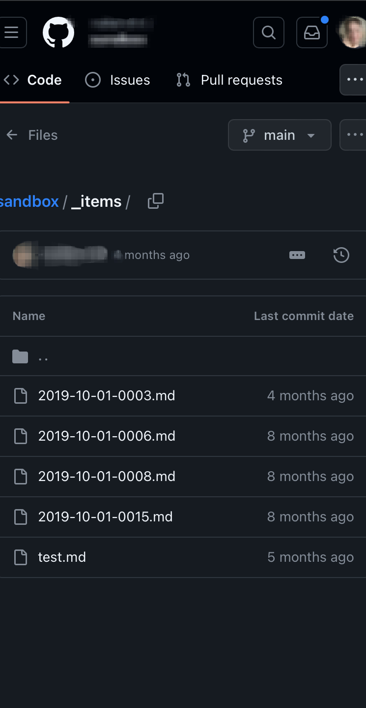

# Creating Markdown Files

## Creating Markdown Files on iPhone
This section covers how to create a markdown file on an iPhone, using a web brower.

1. Navigate to the folder where you want to file to live. In this example, we are creating a new item in a repository called *Sandbox*

2. 
